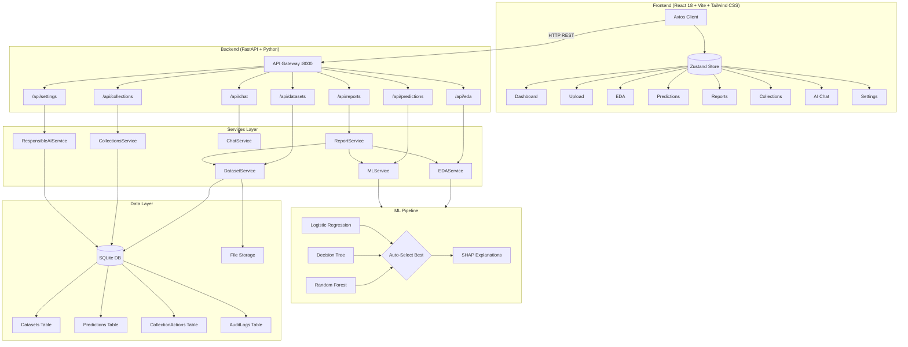
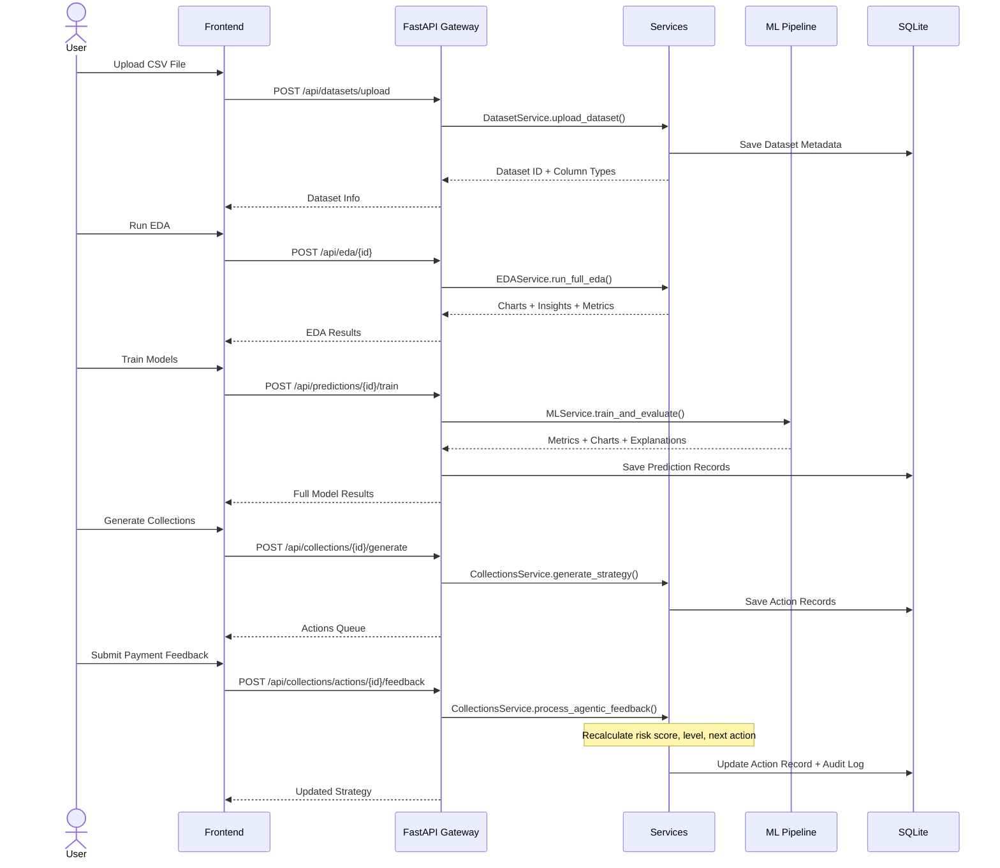
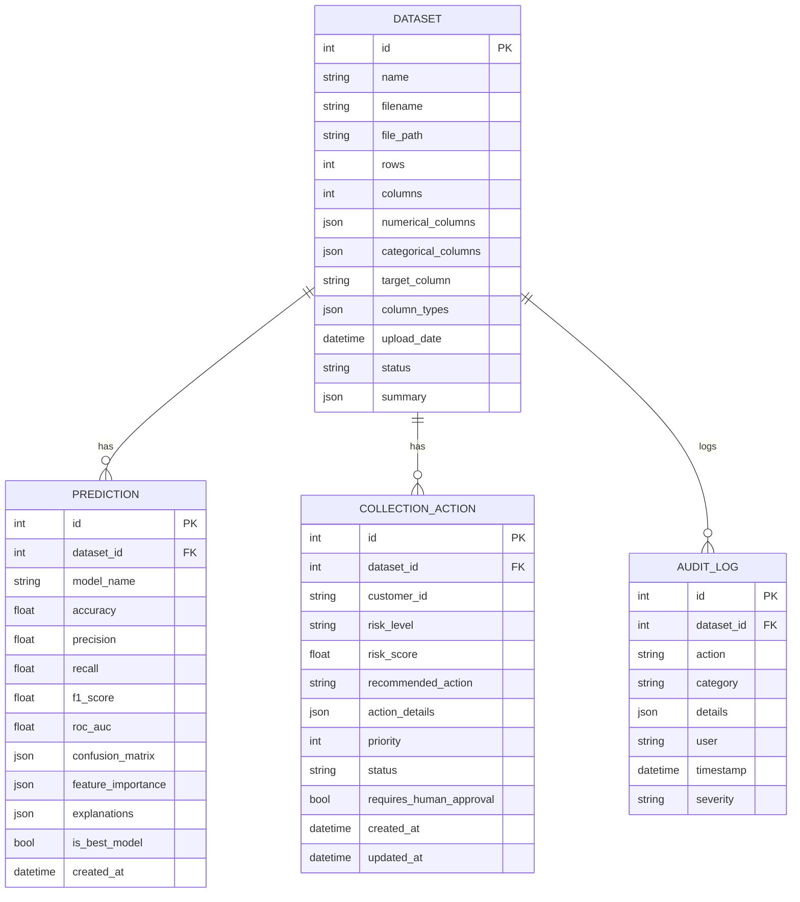
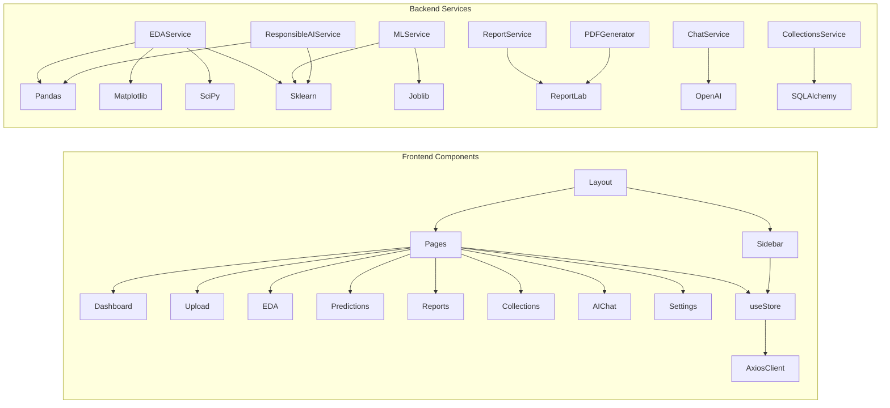

# AI Financial Risk & Collections Assistant — Architecture

## System Architecture Diagram

```mermaid
graph TB
    subgraph FE["Frontend (React 18 + Vite + Tailwind CSS)"]
        direction LR
        D[Dashboard] & U[Upload] & E[EDA] & P[Predictions]
        R[Reports] & C[Collections] & A[AI Chat] & S[Settings]
        ZS[(Zustand Store)] --> D & U & E & P & R & C & A & S
        AX[Axios Client] --> ZS
    end

    subgraph BE["Backend (FastAPI + Python)"]
        direction LR
        GW[API Gateway :8000]
        GW --> DR["/api/datasets"]
        GW --> ER["/api/eda"]
        GW --> PR["/api/predictions"]
        GW --> RR["/api/reports"]
        GW --> CR["/api/collections"]
        GW --> CHR["/api/chat"]
        GW --> SR["/api/settings"]
    end

    subgraph SVC["Services Layer"]
        DS[DatasetService]
        ES[EDAService]
        ML[MLService]
        RS[ReportService]
        CS[CollectionsService]
        AI[ChatService]
        RAI[ResponsibleAIService]
    end

    subgraph MLPIPE["ML Pipeline"]
        LR[Logistic Regression]
        DT[Decision Tree]
        RF[Random Forest]
        SEL{Auto-Select Best}
        LR & DT & RF --> SEL
        SEL --> SHAP[SHAP Explanations]
    end

    subgraph DATA["Data Layer"]
        DB[(SQLite DB)]
        FS[File Storage]
        DB --> DS2[Datasets Table]
        DB --> PR2[Predictions Table]
        DB --> CA[CollectionActions Table]
        DB --> AL[AuditLogs Table]
    end

    AX -->|HTTP REST| GW
    DR --> DS --> DB & FS
    ER --> ES --> MLPIPE
    PR --> ML --> MLPIPE
    RR --> RS --> DS & ES & ML
    CR --> CS --> DB
    CHR --> AI
    SR --> RAI --> DB
```

## Data Flow — Full Pipeline

```mermaid
sequenceDiagram
    actor User
    participant FE as Frontend
    participant API as FastAPI Gateway
    participant SVC as Services
    participant ML as ML Pipeline
    participant DB as SQLite

    User->>FE: Upload CSV File
    FE->>API: POST /api/datasets/upload
    API->>SVC: DatasetService.upload_dataset()
    SVC->>DB: Save Dataset Metadata
    SVC-->>API: Dataset ID + Column Types
    API-->>FE: Dataset Info

    User->>FE: Run EDA
    FE->>API: POST /api/eda/{id}
    API->>SVC: EDAService.run_full_eda()
    SVC-->>API: Charts + Insights + Metrics
    API-->>FE: EDA Results

    User->>FE: Train Models
    FE->>API: POST /api/predictions/{id}/train
    API->>ML: MLService.train_and_evaluate()
    ML-->>API: Metrics + Charts + Explanations
    API->>DB: Save Prediction Records
    API-->>FE: Full Model Results

    User->>FE: Generate Collections
    FE->>API: POST /api/collections/{id}/generate
    API->>SVC: CollectionsService.generate_strategy()
    SVC->>DB: Save Action Records
    API-->>FE: Actions Queue

    User->>FE: Submit Payment Feedback
    FE->>API: POST /api/collections/actions/{id}/feedback
    API->>SVC: CollectionsService.process_agentic_feedback()
    Note over SVC: Recalculate risk score, level, next action
    SVC->>DB: Update Action Record + Audit Log
    API-->>FE: Updated Strategy
```

## ER Diagram

```mermaid
erDiagram
    DATASET {
        int id PK
        string name
        string filename
        string file_path
        int rows
        int columns
        json numerical_columns
        json categorical_columns
        string target_column
        json column_types
        datetime upload_date
        string status
        json summary
    }
    PREDICTION {
        int id PK
        int dataset_id FK
        string model_name
        float accuracy
        float precision
        float recall
        float f1_score
        float roc_auc
        json confusion_matrix
        json feature_importance
        json explanations
        bool is_best_model
        datetime created_at
    }
    COLLECTION_ACTION {
        int id PK
        int dataset_id FK
        string customer_id
        string risk_level
        float risk_score
        string recommended_action
        json action_details
        int priority
        string status
        bool requires_human_approval
        datetime created_at
        datetime updated_at
    }
    AUDIT_LOG {
        int id PK
        int dataset_id FK
        string action
        string category
        json details
        string user
        datetime timestamp
        string severity
    }

    DATASET ||--o{ PREDICTION : "has"
    DATASET ||--o{ COLLECTION_ACTION : "has"
    DATASET ||--o{ AUDIT_LOG : "logs"
```

## Component Architecture

```mermaid
graph LR
    subgraph Frontend Components
        Layout --> Sidebar
        Layout --> Pages
        Pages --> Dashboard & Upload & EDA & Predictions
        Pages --> Reports & Collections & AIChat & Settings
        Sidebar --> useStore
        Pages --> useStore
        useStore --> AxiosClient
    end

    subgraph Backend Services
        EDAService --> Pandas & Matplotlib & SciPy & Sklearn
        MLService --> Sklearn & Joblib
        ReportService --> ReportLab
        ChatService --> OpenAI
        ResponsibleAIService --> Pandas & Sklearn
        CollectionsService --> SQLAlchemy
        PDFGenerator --> ReportLab
    end
```
